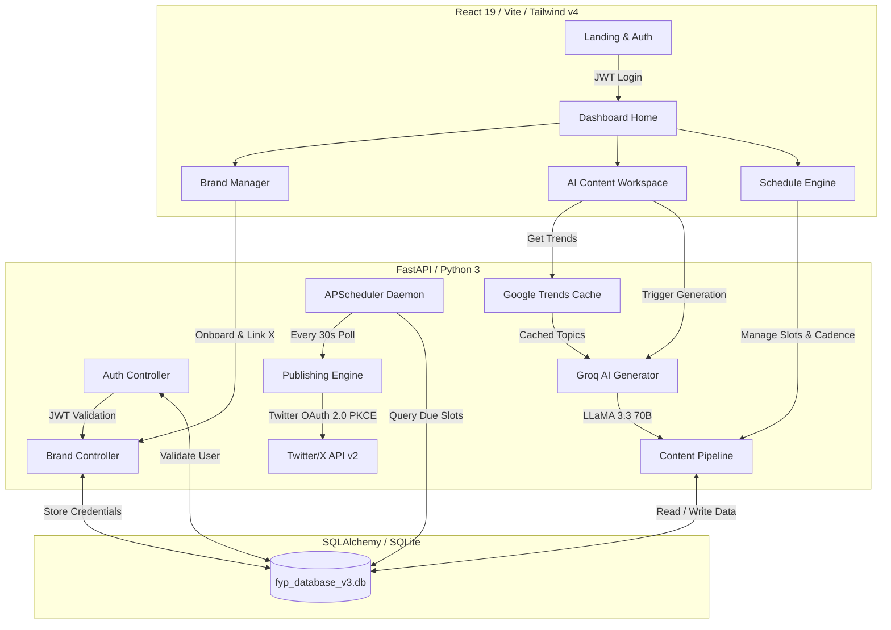

# 🪐 BrandOrbit — AI-Driven Multi-Brand Content Operations Platform

[](https://fastapi.tiangolo.com)
[](https://react.dev)
[](https://tailwindcss.com)
[](https://groq.com)
[](https://sqlite.org)
[](LICENSE)

BrandOrbit is a state-of-the-art, premium Content Management and Automated Scheduling system built for creators, agencies, and brands. Ditch clunky spreadsheets and outdated legacy tools. BrandOrbit integrates real-time **Google Trends detection**, advanced **Groq LLaMA-3.3-70B** content synthesis, customizable **Brand Persona & Guidelines enforcement**, **Human-in-the-loop approvals**, and automatic **Smart Scheduling** directly into a unified social publishing pipeline (connected securely via **Twitter/X OAuth 2.0 PKCE**).

---

## 🗺️ System Architecture

The following diagram illustrates how the core components of BrandOrbit interact, from background trend detection and AI content generation to the automated schedule queue and secure publication.



---

## 🎨 UI/UX Design System & Frontend Visuals

BrandOrbit is built with a **premium dark-mode space aesthetic ("Cosmos Dashboard")**. It abandons boring layouts for dynamic, responsive, and gorgeous glassmorphic interfaces designed to delight the eyes and streamline workflows.

### 🌌 Key Aesthetic Elements
*   **Dynamic Interactive Starfield**: Powered by a custom, lightweight canvas system that generates subtle glowing stars in the background, shifting gently as you navigate.
*   **Vector Mesh Grid Overlay**: A fine coordinate grid with elegant edge fades (`radial-gradient` and intersection masking) that gives depth and a high-tech console feeling to every dashboard screen.
*   **Neon Teal Accent Palette (`#2dd4bf`)**: Core interactive highlights, glows, loader rings, and button borders leverage high-intensity teal that pops against deep charcoal and obsidian foundations.
*   **Glassmorphic Floating Pill Navigation**: Navigation links sit inside a centered, floating pill navbar utilizing heavy blur filters (`backdrop-filter: blur(22px)`), dark translucent backings, and tiny white borders.
*   **Interactive Cards with Border Glows**: Hovering over features or active days causes card borders to transition from dark obsidian to glowing teal, casting subtle soft drop shadows.

---

### 🖥️ Page-by-Page Visual Breakdowns

#### 1️⃣ Landing Page (`Landing.jsx`)
*   **Visual Highlights**: A bold, high-impact hero header stating *"Manage your brands with AI precision"* rendered in high-contrast graphite white, sitting above a dynamic vector representation of a content performance chart.
*   **Interactive Tiers**: Beautiful three-column pricing grid (Starter, Professional, Enterprise) styled with micro-hover translations. The Professional card is wrapped in a glowing teal halo with a custom "Most Popular" floating star badge.

#### 2️⃣ Account Verification & OTP (`VerifyOTP.jsx`)
*   **Visual Highlights**: Minimalist glassmorphic portal centering a glowing mail icon and an intuitive 5-digit code entry block. 
*   **Interactions**: Inputs feature automatic focus-state borders that shift to soft neon teal and prompt a subtle outer box shadow as digits are typed.

#### 3️⃣ Dashboard Home (`DashboardHome.jsx`)
*   **Visual Highlights**: A high-level telemetry cockpit featuring custom analytical cards with large bold stat counters for Scheduled Posts, AI Generations, and Active Brands, complete with green trend capsules (e.g. `+27%`).

#### 4️⃣ Brand Manager (`BrandManager.jsx`)
*   **Visual Highlights**: A dual-panel interface. The left panel allows creators to specify basic brand identities (name, description, niche). The right panel features **AI Persona Tuning**, allowing managers to outline specific Brand Quirks and Guidelines.
*   **Interactions**: Displays dynamic SUGGESTION chips (like *“Uses Gen-Z slang”*, *“Data-driven & analytical”*) which users can click to instantly append to their guidelines. It also hosts the **X Connection Status Panel** with options to initiate OAuth 2.0 PKCE authentication.

#### 5️⃣ AI Content Workspace (`ContentWorkspace.jsx`)
*   **Visual Highlights**:
    *   **Trending Topics HUD**: Displays the latest real-time niches query outcomes in grid items, allowing users to toggle select the active trend focus.
    *   **Replenish HUD**: Includes a large glowing **Generate via AI** button with spinning refresh icons when active.
    *   **Draft Board**: Rendered as deep slate tiles. Each draft displays the exact content body, a character counter (`280` limit validation), and interactive buttons for inline text editing, deleting, or approving.
    *   **Status Queue**: Lists upcoming scheduled posts in a clean timeline view showing the calculated scheduling slots.

#### 6️⃣ Schedule Engine (`ScheduleEngine.jsx`)
*   **Visual Highlights**:
    *   **Step-by-Step Cadence Builder**: Styled step numbers (`1`, `2`, `3`) that configure Active Posting Days, Daily Time Slots (up to 3 separate times), and AI Posting Volume (Chill, Growth, Viral).
    *   **Chronological Queue timeline**: A vertical queue displaying exactly what is "Up Next" (with a breathing teal heartbeat point) and subsequent slots, including options to eject posts back to draft.

---

## ⚙️ Backend Architecture & Database Engine

The BrandOrbit backend is engineered for performance, security, and smart background automation. Built entirely in Python using **FastAPI**, it leverages high-speed async processing and strict rate limit controls.

### 🛡️ Authentication & Security
*   **JWT Handshake**: Implements secure Bearer token authentication (`python-jose` with `HS256` signing) validating logins and persisting sessions securely. Tokens are issued with a default 7-day longevity.
*   **Hashed Passwords**: User passwords are encrypted before database commitment using `passlib` context running a multi-round `bcrypt` algorithm.

### 📊 Database Schema (SQLAlchemy + SQLite)
The SQL engine is backed by a lightweight SQLite database (`fyp_database_v3.db`). The entity-relationship model consists of five key tables:

```
                          ┌───────────────┐
                          │     User      │
                          └───────┬───────┘
                                  │ 1
                                  │
                                  │ *
                          ┌───────▼───────┐
                          │     Brand     │◄───────────────────────┐
                          └─┬───┬───┬───┬─┘                        │
                            │ 1 │ 1 │ 1 │ 1                        │
                            │   │   │   └────────────────────────┐ │
                            │   │   │                            │ │
  ┌───────────────┐         │   │   └───────────────┐            │ │
  │  PostingPlan  │◄────────┘   │                   │            │ │
  └───────────────┘ 1           │ *                 │ *          │ │ 1
                                ▼                   ▼            │ │
                        ┌───────────────┐   ┌───────────────┐    │ │
                        │  ContentItem  │   │ ValidationRule│    │ │
                        └───────┬───────┘   └───────────────┘    │ │
                                │ *                              │ │
                                └────────────────────────────────┘─┘
```

#### 1. `users`
Represents application accounts and authorization levels.
*   `id` (Integer, PK)
*   `email` (String, Unique, Index)
*   `hashed_password` (String)
*   `role` (Enum: `ADMIN`, `EDITOR`)

#### 2. `brands`
Stores brand identities, AI persona rules, rate limits, and connected API credentials.
*   `id` (Integer, PK)
*   `name` (String, Unique, Index)
*   `description` (Text)
*   `niche` (String)
*   `quirks` (Text)
*   `persona_guidelines` (Text)
*   `twitter_oauth2_access_token` / `twitter_oauth2_refresh_token` (String, Encrypted OAuth 2.0 Credentials)
*   `twitter_oauth2_token_expires_at` (DateTime)
*   `twitter_username` (String)
*   `automation_mode` (String: `manual`, `semi-automated`, `fully-automated`)
*   `generations_today` / `posts_today` (Integer, Daily Rate limit tracking)
*   `last_generation_date` / `last_post_date` (Date, Rate limit tracking reset triggers)
*   `owner_id` (Integer, FK -> `users.id`)

#### 3. `posting_plans`
Defines scheduling boundaries and volume targets.
*   `id` (Integer, PK)
*   `brand_id` (Integer, FK -> `brands.id`, Unique)
*   `active_days` (JSON Array: e.g., `["Monday", "Wednesday", "Friday"]`)
*   `time_slots` (JSON Array: e.g., `["09:00", "17:00"]`)
*   `volume` (String: `chill`, `growth`, `viral`)

#### 4. `content_items`
Holds content pieces, scheduled dates, and API statuses.
*   `id` (Integer, PK)
*   `brand_id` (Integer, FK -> `brands.id`)
*   `body` (Text)
*   `status` (Enum: `DRAFT`, `PENDING_APPROVAL`, `APPROVED`, `REJECTED`, `SCHEDULED`, `PUBLISHED`)
*   `scheduled_for` (DateTime, Nullable)
*   `tweet_id` (String, Nullable, stores published Twitter Reference ID)
*   `author_id` (Integer, FK -> `users.id`)

#### 5. `validation_rules`
Supports automated content moderation filters.
*   `id` (Integer, PK)
*   `brand_id` (Integer, FK -> `brands.id`)
*   `rule_type` (String: e.g., `forbidden_words`, `max_length`)
*   `parameters` (JSON Object: e.g., `{"words": ["spam", "ad"]}`)

---

### 🤖 Intelligent Core Automations

#### 1. Niche Trend Analytics Cache
The Google Trends scraper (`pytrends`) is resource-heavy and highly prone to IP rate limits. BrandOrbit implements a custom **4-hour server-side cache (`_trend_cache`)** grouped by niche key. If a cache miss occurs, the system queries pytrends, retrieves rising Google searches, and triggers the Groq LLM to refine the raw keywords into 3 human-readable content angles.

#### 2. Auto-Pilot Mode (`maintain_auto_queue`)
If a brand is set to Fully-Automated (`auto` mode), a background worker automatically ensures the queue always has at least 3 scheduled items. If the count drops below 3, the engine:
1.  Pulls existing approved drafts, OR
2.  Triggers Groq AI to instantly synthesize new drafts aligned with the brand niche, quirks, and active trends.
3.  Saves them and automatically slots them into the next calendar windows via `recalculate_queue`.

#### 3. Queue Recalculation Engine (`recalculate_queue`)
When a new post is scheduled or a draft is approved, the system scans the brand’s `PostingPlan` (active days and daily time slots), calculates chronological availability starting from the current datetime, skips already reserved slots, and maps out dates automatically (shifting placeholder values to real execution slots).

#### 4. The APScheduler Background Daemon
FastAPI initializes a `BackgroundScheduler` running an interval trigger **every 30 seconds**. This scheduler:
*   Queries the `content_items` table for posts marked `SCHEDULED` whose `scheduled_for` timestamp is `<= datetime.now()`.
*   Fetches the brand profiles and resets the daily limits if a new day has arrived.
*   Performs rate checks (rejects publishing if the brand exceeds `3` posts a day).
*   Checks if OAuth tokens are expired, automatically triggers a **secure Refresh Token flow** with Twitter servers, commits the refreshed credentials, and publishes the post.

---

## 🔒 Security, Credentials & API Safety

BrandOrbit is architected around security. System keys and environment variables are strictly isolated to prevent leaks.

### 🔑 Key Requirements
Configure a `.env` file inside the `backend` folder with these variables:
*   `SECRET_KEY`: Used for hashing JWT tokens. Generate with `openssl rand -hex 32`.
*   `GROQ_API_KEY`: Required to access Groq's high-speed LLaMA-3.3 models.
*   `TWITTER_CLIENT_ID` & `TWITTER_CLIENT_SECRET`: Crucial for Twitter/X OAuth 2.0 PKCE.
*   `TWITTER_API_KEY` & `TWITTER_API_SECRET`: Deprecated OAuth 1.0a fallback (optional).

### 🛡️ Secure Git Configuration
Our system incorporates absolute safety. The root `.gitignore` is structured to block secret exposures:
```git
# Block env files
.env
backend/.env
frontend/.env
*.env

# Block SQLite databases
*.db
*.sqlite3
backend/fyp_database_v3.db
```
API endpoints that retrieve brand configurations automatically suppress sensitive keys and hash credentials before outputting JSON to the client.

---

## 🛣️ API Endpoints Reference

| HTTP Method | Endpoint | Description | Auth Required |
| :--- | :--- | :--- | :--- |
| **POST** | `/api/auth/register` | Register new user profile | No |
| **POST** | `/api/auth/login` | Authenticate user & return JWT token | No |
| **GET** | `/api/users/me` | Fetch active user credentials | Yes (Bearer) |
| **POST** | `/api/brands/` | Create a brand identity | Yes (Bearer) |
| **GET** | `/api/brands/` | List all user brands | Yes (Bearer) |
| **GET** | `/api/brands/{id}` | Retrieve detailed brand metadata | Yes (Bearer) |
| **PUT** | `/api/brands/{id}` | Edit brand identity & AI guidelines | Yes (Bearer) |
| **PUT** | `/api/brands/{id}/mode` | Update brand automation mode | Yes (Bearer) |
| **GET** | `/api/brands/{id}/plan` | Fetch brand posting calendar rules | Yes (Bearer) |
| **POST** | `/api/brands/{id}/plan` | Update brand posting calendar rules | Yes (Bearer) |
| **GET** | `/api/brands/{id}/trends` | Retrieve real-time cache-managed niche trends | Yes (Bearer) |
| **POST** | `/api/brands/{id}/generate` | AI-generate drafts matching current trends | Yes (Bearer) |
| **GET** | `/api/brands/{id}/content` | Get all content items associated with a brand | Yes (Bearer) |
| **PUT** | `/api/content/{id}` | Edit content item body | Yes (Bearer) |
| **DELETE** | `/api/content/{id}` | Delete content item draft | Yes (Bearer) |
| **POST** | `/api/content/{id}/submit` | Submit draft for approval | Yes (Bearer) |
| **POST** | `/api/content/{id}/approve` | Approve draft content item | Yes (Bearer) |
| **POST** | `/api/content/{id}/reject` | Reject draft content item | Yes (Bearer) |
| **POST** | `/api/content/{id}/schedule` | Schedule content for specific datetime | Yes (Bearer) |
| **POST** | `/api/content/{id}/smart_schedule` | Auto-slot content using brand posting plan | Yes (Bearer) |
| **POST** | `/api/content/{id}/approve_and_queue`| Approve and automatically schedule into timeline | Yes (Bearer) |
| **POST** | `/api/content/{id}/remove_queue` | Pull content item from queue back to draft | Yes (Bearer) |
| **POST** | `/api/content/{id}/publish` | Instantly publish post to Twitter/X | Yes (Bearer) |
| **GET** | `/api/auth/twitter/login` | Initiate Twitter OAuth 2.0 PKCE flow | Yes (Bearer) |
| **GET** | `/api/auth/twitter/callback` | Callback for Twitter OAuth PKCE authentication | No |
| **POST** | `/api/brands/{id}/disconnect` | Disconnect X profile and wipe tokens | Yes (Bearer) |

---

## 🛠️ Installation & Getting Started

### 📋 Prerequisites
Ensure you have the following installed on your system:
*   [Python 3.10+](https://www.python.org/downloads/)
*   [Node.js v18+](https://nodejs.org/)
*   Git

### 📂 Repository Structure
```
Final Year Project/
├── backend/
│   ├── main.py              # Main FastAPI application
│   ├── auth.py              # Auth & JWT utilities
│   ├── database.py          # SQLAlchemy SQLite connection
│   ├── models.py            # Database tables
│   ├── schemas.py           # Pydantic payloads
│   ├── requirements.txt     # Python packages
│   └── .env                 # Backend keys (Ignored)
├── frontend/
│   ├── src/                 # React source code
│   │   ├── components/      # Navigation & UI components
│   │   ├── pages/           # Core workflow screens
│   │   └── App.jsx          # Route manager
│   ├── package.json         # JS packages
│   └── vite.config.js       # Vite build setup
└── README.md                # Documentation (You are here)
```

---

### 1️⃣ Setting Up the Backend
1.  Navigate to the `backend` directory:
    ```bash
    cd backend
    ```
2.  Create a virtual environment:
    ```bash
    python -m venv venv
    ```
3.  Activate the virtual environment:
    *   **Windows (PowerShell)**:
        ```powershell
        .\venv\Scripts\Activate.ps1
        ```
    *   **macOS / Linux**:
        ```bash
        source venv/bin/activate
        ```
4.  Install dependencies:
    ```bash
    pip install -r requirements.txt
    ```
5.  Create a `.env` file inside the `backend` folder and populate it:
    ```env
    SECRET_KEY=your_generated_jwt_secret
    GROQ_API_KEY=your_groq_api_key
    TWITTER_CLIENT_ID=your_twitter_oauth2_client_id
    TWITTER_CLIENT_SECRET=your_twitter_oauth2_client_secret
    ```
6.  Start the FastAPI development server:
    ```bash
    uvicorn main:app --reload
    ```
    The API documentation will be available at `http://127.0.0.1:8000/docs`.

---

### 2️⃣ Setting Up the Frontend
1.  Open a new terminal and navigate to the `frontend` directory:
    ```bash
    cd frontend
    ```
2.  Install packages:
    ```bash
    npm install
    ```
3.  Start the local development server:
    ```bash
    npm run dev
    ```
4.  Open your browser and navigate to `http://localhost:5173` (or the port specified by Vite).

---

## 🏆 Development Team & Support

BrandOrbit was designed and developed as a Final Year Project to solve real-world AI-driven social content coordination hurdles. 
For help, questions, or issues, please open a GitHub Issue in this repository.

*“Who said content management has to be boring?”* — **Launch BrandOrbit and automate with precision!**