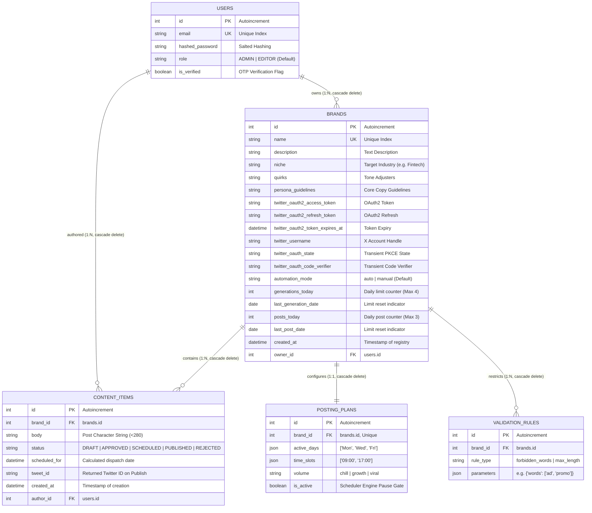
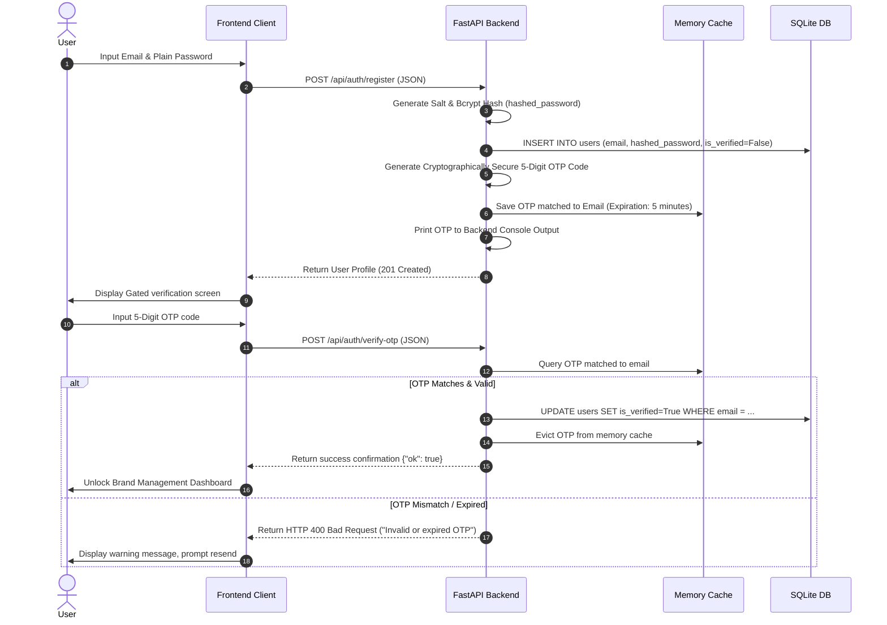
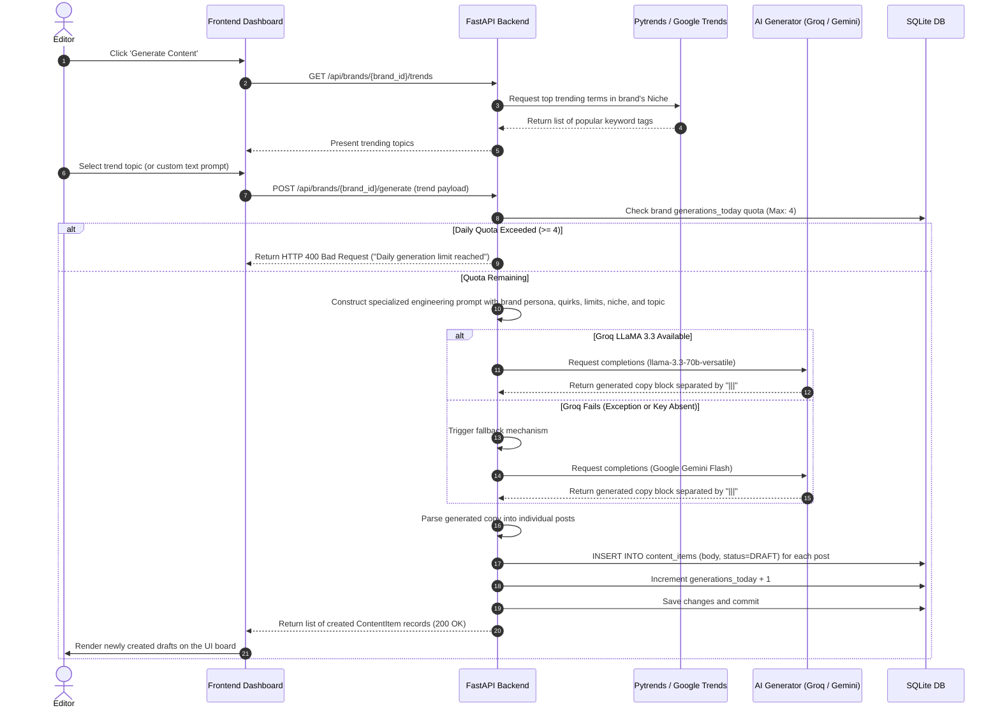
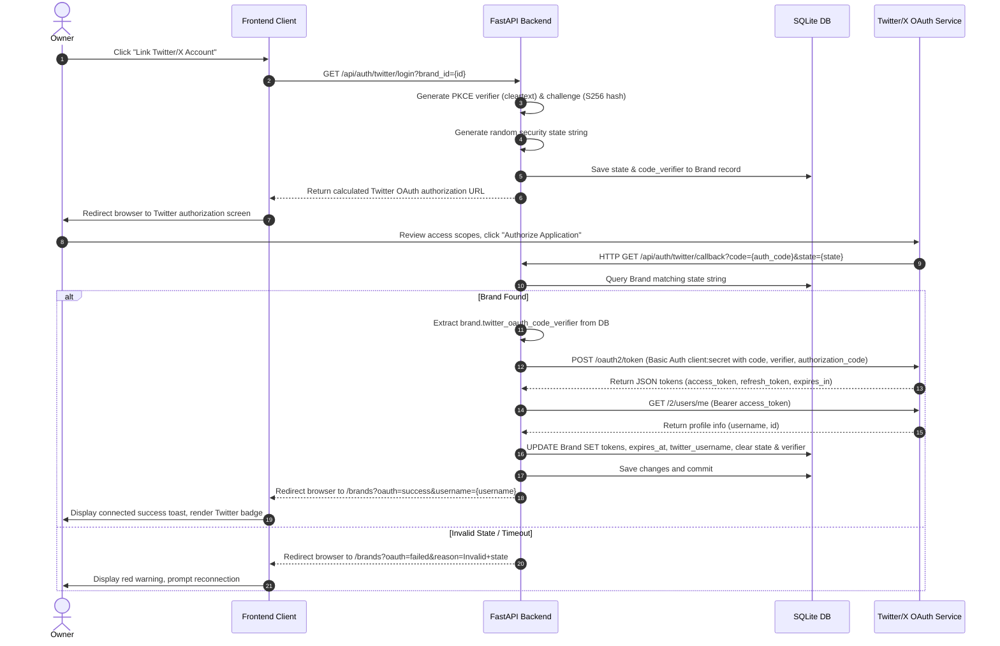
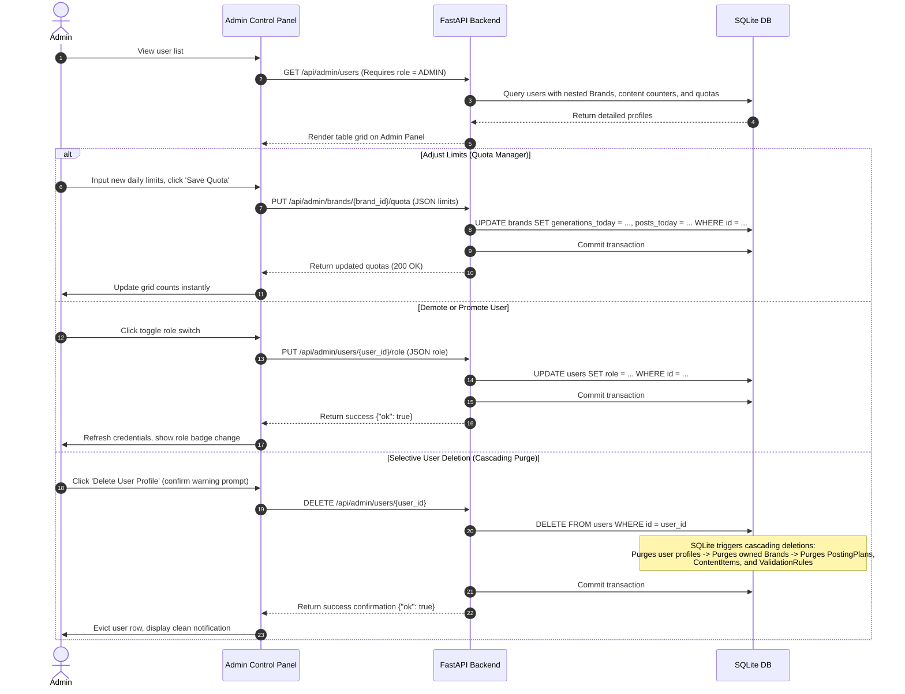
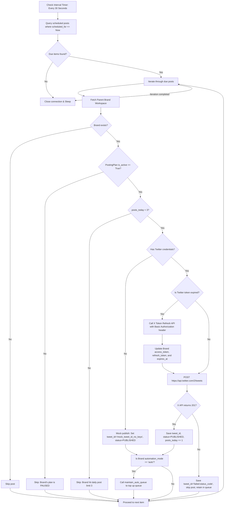

# BrandOrbit Backend Architecture & API Specification Guide

This guide serves as the definitive reference manual for the **BrandOrbit** backend subsystem. It details the system architecture, database design (ERD, schemas, relational rules), core workflows, automation engines, and an exhaustive API catalog with precise request/response schemas.

---

## 1. System Architecture & Core Stack

The BrandOrbit backend is built with a modular, asynchronous, type-safe Python stack designed for speed, operational reliability, and relational integrity.

```
                          ┌──────────────────────────┐
                          │    Next.js / Vite UI     │
                          └─────────────┬────────────┘
                                        │ (HTTP REST / JWT)
                                        ▼
                          ┌──────────────────────────┐
                          │   FastAPI Web Engine     │
                          └──────┬────────────┬──────┘
                                 │            │
         (SQLAlchemy ORM) ───────┘            └─────── (Async Work Loops)
                 ▼                                                 ▼
     ┌───────────────────────┐                         ┌───────────────────────┐
     │ SQLite DB Engine      │                         │ APScheduler Daemon    │
     │ (fyp_database_v3.db)  │                         │ - Auto-Publisher (30s)│
     └───────────────────────┘                         │ - Quota Reset (Daily) │
                                                       └───────────┬───────────┘
                                                                   │
                                                                   ▼
                                                       ┌───────────────────────┐
                                                       │ External APIs         │
                                                       │ - Twitter/X API v2    │
                                                       │ - Google Trends API   │
                                                       │ - AI: Groq & Gemini   │
                                                       └───────────────────────┘
```

### Dependency Blueprint (`requirements.txt` Core)
* **FastAPI (0.136.1)**: Asynchronous ASGI framework for building type-safe APIs with dynamic OpenAPI documentation.
* **SQLAlchemy (2.0.49)**: SQL Toolkit and Object-Relational Mapper (ORM) configured with cascading purges and native foreign key enforcements.
* **APScheduler (3.11.2)**: In-process task scheduler running thread pools for auto-publishing and daily quota maintenance.
* **Groq (1.2.0)**: High-speed primary client library using LLaMA-3.3-70B-Versatile for persona-aligned draft copy generation.
* **Google-GenerativeAI (0.8.6)**: Failover client library running Gemini-Flash-Latest to guarantee generative resilience.
* **Python-Jose (3.5.0)**: JSON Web Signature (JWS) and JSON Web Token (JWT) handling for user sessions.
* **Bcrypt (4.0.1)**: Cryptographic hashing library used to secure user credentials at rest.
* **PyTrends (4.9.2)**: Google Trends client used to collect viral industry tags tailored to brand niches.

---

## 2. Entity-Relationship Diagram (ERD)

The relational schema is optimized to ensure clean ownership hierarchies, relational constraints, and dynamic cascade rules. 



---

## 3. Database Table Schemas & Relational Rules

### A. Table: `users`
Acts as the central entity for system access controls. Accounts represent editors or administrators.

| Column | Datatype | Constraints | Default | Description |
| :--- | :--- | :--- | :--- | :--- |
| `id` | `INTEGER` | `PRIMARY KEY`, `AUTOINCREMENT` | None | Unique user ID. |
| `email` | `VARCHAR(255)` | `UNIQUE`, `NOT NULL`, `INDEX` | None | Login credential email address. |
| `hashed_password`| `VARCHAR(255)` | `NOT NULL` | None | Hashed password string (Bcrypt). |
| `role` | `VARCHAR(50)` | `NOT NULL`, `Enum (UserRoleEnum)` | `UserRoleEnum.EDITOR` | Permissions: `ADMIN` or `EDITOR`. |
| `is_verified` | `BOOLEAN` | `NOT NULL` | `False` | OTP activation gate indicator. |

* **Relational Actions & Cascades**:
  * Deleting a user triggers an ORM-level cascading purge (`cascade="all, delete-orphan"`) of all associated workspaces in the `brands` table.
  * Deleting a user triggers a cascading purge of all posts created by the user in `content_items`.

---

### B. Table: `brands`
Defines isolated brand workspaces. Each brand holds independent Twitter keys, guidelines, and quotas.

| Column | Datatype | Constraints | Default | Description |
| :--- | :--- | :--- | :--- | :--- |
| `id` | `INTEGER` | `PRIMARY KEY`, `AUTOINCREMENT` | None | Unique brand identifier. |
| `name` | `VARCHAR(255)` | `UNIQUE`, `NOT NULL`, `INDEX` | None | User-assigned brand name. |
| `description` | `TEXT` | `NULLABLE` | None | Explanatory description of the brand identity. |
| `niche` | `VARCHAR(100)` | `NULLABLE` | None | Industry category for trend gathering. |
| `quirks` | `TEXT` | `NULLABLE` | None | Adjective descriptors for copywriting style. |
| `persona_guidelines`| `TEXT` | `NOT NULL` | None | Hard constraints fed to the generative AI models. |
| `twitter_oauth2_access_token` | `VARCHAR(512)`| `NULLABLE` | None | Connected X account OAuth 2.0 user access token. |
| `twitter_oauth2_refresh_token`| `VARCHAR(512)`| `NULLABLE` | None | Secure refresh token used to request fresh keys. |
| `twitter_oauth2_token_expires_at`| `DATETIME` | `NULLABLE` | None | Precise UTC expiration timestamp of access token. |
| `twitter_username` | `VARCHAR(100)` | `NULLABLE` | None | Connected Twitter handle (e.g. `@brand_xyz`). |
| `twitter_oauth_state` | `VARCHAR(255)` | `NULLABLE` | None | Transient code used to match PKCE callbacks. |
| `twitter_oauth_code_verifier`| `VARCHAR(255)` | `NULLABLE` | None | Transient PKCE cleartext token verifier. |
| `automation_mode` | `VARCHAR(50)` | `NOT NULL` | `"manual"` | Autopilot mode: `"auto"` or `"manual"`. |
| `generations_today`| `INTEGER` | `NOT NULL` | `0` | AI generation counter today (Limit: 4 queries). |
| `last_generation_date`| `DATE` | `NULLABLE` | None | Generative quota validation date tracker. |
| `posts_today` | `INTEGER` | `NOT NULL` | `0` | Twitter publish counter today (Limit: 3 posts). |
| `last_post_date` | `DATE` | `NULLABLE` | None | Dispatch quota validation date tracker. |
| `created_at` | `DATETIME` | `NOT NULL` | `utcnow()` | Brand workspace creation timestamp. |
| `owner_id` | `INTEGER` | `FOREIGN KEY -> users.id` | None | Owner user account reference. |

* **Relational Actions & Cascades**:
  * Deleting a brand triggers an automatic cascading purge (`cascade="all, delete-orphan"`) of:
    * The associated automated schedule in `posting_plans` (1:1 relationship).
    * All queue drafts, pending items, and published historical logs in `content_items` (1:N relationship).
    * Custom filters, keywords, and restrictions in `validation_rules` (1:N relationship).

---

### C. Table: `posting_plans`
Stores scheduling strategies and targeted publishing times for auto-scheduled campaigns.

| Column | Datatype | Constraints | Default | Description |
| :--- | :--- | :--- | :--- | :--- |
| `id` | `INTEGER` | `PRIMARY KEY`, `AUTOINCREMENT` | None | Unique posting plan identifier. |
| `brand_id` | `INTEGER` | `FOREIGN KEY -> brands.id`, `UNIQUE` | None | Link to the workspace (strictly enforced 1:1). |
| `active_days` | `JSON` | `NOT NULL` | None | Serialized list of days (e.g., `["Monday", "Wednesday"]`). |
| `time_slots` | `JSON` | `NOT NULL` | None | Serialized list of 24-hr slots (e.g., `["09:00", "15:30"]`). |
| `volume` | `VARCHAR(50)` | `NOT NULL` | None | Strategy name: `"chill"` (1/day), `"growth"` (2/day), `"viral"` (3/day). |
| `is_active` | `BOOLEAN` | `NOT NULL` | `True` | Global switch: `True` (active queue), `False` (pause auto-posting). |

---

### D. Table: `content_items`
Holds copywriting drafts, queued scheduled posts, and historically completed X publication records.

| Column | Datatype | Constraints | Default | Description |
| :--- | :--- | :--- | :--- | :--- |
| `id` | `INTEGER` | `PRIMARY KEY`, `AUTOINCREMENT` | None | Unique post identifier. |
| `brand_id` | `INTEGER` | `FOREIGN KEY -> brands.id` | None | Relates post to its parent brand workspace. |
| `body` | `TEXT` | `NOT NULL` | None | Raw text content of the social media post (< 280 chars). |
| `status` | `VARCHAR(50)` | `NOT NULL`, `Enum (StatusEnum)`| `StatusEnum.DRAFT` | Status: `DRAFT`, `PENDING_APPROVAL`, `APPROVED`, `REJECTED`, `SCHEDULED`, `PUBLISHED`. |
| `scheduled_for` | `DATETIME` | `NULLABLE` | None | Precise date/hour for scheduled publishing. |
| `tweet_id` | `VARCHAR(100)` | `NULLABLE` | None | Valid Twitter Tweet ID returned after publish. |
| `created_at` | `DATETIME` | `NOT NULL` | `utcnow()` | Post record creation timestamp. |
| `author_id` | `INTEGER` | `FOREIGN KEY -> users.id` | None | User account ID of the post author. |

---

### E. Table: `validation_rules`
Defines safety filters, blocked keywords, and structural constraints for generated copy.

| Column | Datatype | Constraints | Default | Description |
| :--- | :--- | :--- | :--- | :--- |
| `id` | `INTEGER` | `PRIMARY KEY`, `AUTOINCREMENT` | None | Unique validation rule identifier. |
| `brand_id` | `INTEGER` | `FOREIGN KEY -> brands.id` | None | Relates rule to a target workspace. |
| `rule_type` | `VARCHAR(100)` | `NOT NULL` | None | Rule type: `"forbidden_words"`, `"max_length"`. |
| `parameters` | `JSON` | `NOT NULL` | None | Configuration fields (e.g. `{"words": ["spam", "buy"]}`). |

---

## 4. End-to-End Core Workflows

### A. Account Registration, Salted Password Hashing, Console OTP, and Verification Gating
Secures authentication by requiring OTP verification before access is granted.



---

### B. Brand Workspace Setup & Dynamic Content Generation Strategy
Coordinates trending keywords and persona guidelines with LLMs to generate brand-aligned drafts.



---

### C. Social Authorization Loop (Twitter/X OAuth 2.0 PKCE Handshake Callback and Linkage)
Uses secure OAuth 2.0 Proof Key for Code Exchange (PKCE) flow to link workspaces with Twitter/X.



---

### D. Queue Relalculation Algorithm and Auto-Publishing Dispatch Daemon
Dynamically manages and executes scheduled content based on the brand's posting plan.

```mermaid
flowchart TD
    A[Start recalculate_queue] --> B{PostingPlan configured & active?}
    B -- No --> C[Set all SCHEDULED and APPROVED items status to APPROVED, set scheduled_for = Null]
    C --> D[Commit & exit]
    B -- Yes --> E{Are days or slots empty?}
    E -- Yes --> C
    E -- No --> F[Query all SCHEDULED and APPROVED items sorted by created_at]
    F --> G[Map weekday names to indices 0-6]
    G --> H[Initialize start_time = now, slot_list = empty]
    H --> I[Check current day index]
    I --> J{Is day active?}
    J -- Yes --> K[Sort plan time_slots chronologically]
    K --> L[Generate timestamps for slots today]
    L --> M{Is timestamp > now?}
    M -- Yes --> N[Add timestamp to slot_list]
    M -- No --> O[Skip past slot]
    O --> P{Slots count >= items count?}
    N --> P
    J -- No --> Q[Add 1 day to current day]
    P -- No --> Q
    Q --> I
    P -- Yes --> R[Iterate items and assign: item.status = SCHEDULED, item.scheduled_for = slot_list[i]]
    R --> S[Save and commit database transaction]
    S --> T[End recalculate_queue]
```

---

### E. Admin Dashboard Operations
Enables administrators to manage users, update quotas, and delete profiles with automatic cascades.



---

## 5. Exhaustive API Endpoint Catalog

All routes are secured by token-based authentication. The active session must include an `Authorization: Bearer <JWT_Token>` header unless designated as `Anonymous`.

---

### A. Authentication & Session Services

#### 1. POST `/api/auth/register`
* **Access Level**: `Anonymous`
* **Request JSON Body**:
```json
{
  "email": "editor@company.com",
  "password": "SecurePassword123"
}
```
* **Success Response (201 Created)**:
```json
{
  "email": "editor@company.com",
  "role": "EDITOR",
  "is_verified": false,
  "id": 18
}
```
* **Failure Responses**:
  * `400 Bad Request`: `{"detail": "Email already registered"}`
  * `422 Unprocessable Entity`: Input failed validation checks.

#### 2. POST `/api/auth/login`
* **Access Level**: `Anonymous`
* **Request Content-Type**: `application/x-www-form-urlencoded`
* **Request Body Fields**:
  * `username` (email): `"editor@company.com"`
  * `password`: `"SecurePassword123"`
* **Success Response (200 OK)**:
```json
{
  "access_token": "eyJhbGciOiJIUzI1NiIsInR5cCI6IkpXVCJ9...",
  "token_type": "bearer"
}
```
* **Failure Responses**:
  * `401 Unauthorized`: `{"detail": "Incorrect email or password"}`

#### 3. POST `/api/auth/verify-otp`
* **Access Level**: `Anonymous` (verification token sent in payload)
* **Request JSON Body**:
```json
{
  "email": "editor@company.com",
  "otp": "48921"
}
```
* **Success Response (200 OK)**:
```json
{
  "ok": true,
  "user": {
    "email": "editor@company.com",
    "role": "EDITOR",
    "is_verified": true,
    "id": 18
  }
}
```
* **Failure Responses**:
  * `400 Bad Request`: `{"detail": "Invalid or expired OTP code"}`

#### 4. POST `/api/auth/resend-otp`
* **Access Level**: `Anonymous`
* **Request JSON Body**:
```json
{
  "email": "editor@company.com"
}
```
* **Success Response (200 OK)**:
```json
{
  "ok": true
}
```

#### 5. GET `/api/users/me`
* **Access Level**: `Authenticated User`
* **Headers**: `Authorization: Bearer <JWT_Token>`
* **Success Response (200 OK)**:
```json
{
  "email": "editor@company.com",
  "role": "EDITOR",
  "is_verified": true,
  "id": 18
}
```
* **Failure Responses**:
  * `401 Unauthorized`: `{"detail": "Could not validate credentials"}`

---

### B. Brands & Workspace Settings

#### 1. POST `/api/brands/`
* **Access Level**: `Verified User` (Requires `is_verified == True`)
* **Headers**: `Authorization: Bearer <JWT_Token>`
* **Request JSON Body**:
```json
{
  "name": "Acme Tech",
  "description": "Tech agency workspace",
  "niche": "Technology",
  "quirks": "Professional, emoji-lite",
  "persona_guidelines": "Focus on high-quality code and engineering excellence."
}
```
* **Success Response (201 Created)**:
```json
{
  "name": "Acme Tech",
  "description": "Tech agency workspace",
  "niche": "Technology",
  "quirks": "Professional, emoji-lite",
  "persona_guidelines": "Focus on high-quality code and engineering excellence.",
  "twitter_oauth2_access_token": null,
  "twitter_oauth2_refresh_token": null,
  "twitter_oauth2_token_expires_at": null,
  "twitter_username": null,
  "twitter_oauth_state": null,
  "twitter_oauth_code_verifier": null,
  "automation_mode": "manual",
  "generations_today": 0,
  "last_generation_date": null,
  "posts_today": 0,
  "last_post_date": null,
  "id": 5,
  "created_at": "2026-05-22T02:15:30",
  "validation_rules": [],
  "posting_plan": null
}
```
* **Failure Responses**:
  * `400 Bad Request`: `{"detail": "Brand name already exists"}`
  * `403 Forbidden`: `{"detail": "Account not verified. Please verify your OTP first."}`

#### 2. GET `/api/brands/`
* **Access Level**: `Verified User`
* **Headers**: `Authorization: Bearer <JWT_Token>`
* **Success Response (200 OK)**:
```json
[
  {
    "name": "Acme Tech",
    "description": "Tech agency workspace",
    "niche": "Technology",
    "quirks": "Professional, emoji-lite",
    "persona_guidelines": "Focus on high-quality code and engineering excellence.",
    "twitter_username": "@acme_tech",
    "automation_mode": "manual",
    "generations_today": 1,
    "posts_today": 0,
    "id": 5,
    "created_at": "2026-05-22T02:15:30"
  }
]
```

#### 3. GET `/api/brands/{brand_id}`
* **Access Level**: `Verified User`
* **Headers**: `Authorization: Bearer <JWT_Token>`
* **Path Parameters**: `brand_id` (integer)
* **Success Response (200 OK)**:
```json
{
  "name": "Acme Tech",
  "description": "Tech agency workspace",
  "niche": "Technology",
  "quirks": "Professional, emoji-lite",
  "persona_guidelines": "Focus on high-quality code and engineering excellence.",
  "twitter_username": "@acme_tech",
  "automation_mode": "manual",
  "generations_today": 1,
  "last_generation_date": "2026-05-22",
  "posts_today": 0,
  "last_post_date": null,
  "id": 5,
  "created_at": "2026-05-22T02:15:30",
  "validation_rules": [],
  "posting_plan": {
    "active_days": ["Monday", "Wednesday", "Friday"],
    "time_slots": ["09:00", "15:00"],
    "volume": "growth",
    "is_active": true,
    "id": 2,
    "brand_id": 5
  }
}
```
* **Failure Responses**:
  * `404 Not Found`: `{"detail": "Brand not found"}`

#### 4. PUT `/api/brands/{brand_id}`
* **Access Level**: `Verified User`
* **Headers**: `Authorization: Bearer <JWT_Token>`
* **Path Parameters**: `brand_id` (integer)
* **Request JSON Body**:
```json
{
  "name": "Acme Tech Pro",
  "description": "Upgraded enterprise tech workspace",
  "niche": "Technology & Enterprise AI",
  "quirks": "Professional, insightful",
  "persona_guidelines": "Focus on high-quality code, developer velocity, and enterprise AI."
}
```
* **Success Response (200 OK)**: Returns the updated Brand object.
* **Failure Responses**:
  * `404 Not Found`: `{"detail": "Brand not found"}`

#### 5. PUT `/api/brands/{brand_id}/mode`
* **Access Level**: `Verified User`
* **Headers**: `Authorization: Bearer <JWT_Token>`
* **Path Parameters**: `brand_id` (integer)
* **Request JSON Body**:
```json
{
  "automation_mode": "auto"
}
```
* **Success Response (200 OK)**: Returns the updated Brand object with `"automation_mode": "auto"`. Triggers `maintain_auto_queue` internally to fill slots automatically.

---

### C. Content Queue & Scheduled Slots

#### 1. POST `/api/brands/{brand_id}/content`
* **Access Level**: `Verified User`
* **Headers**: `Authorization: Bearer <JWT_Token>`
* **Path Parameters**: `brand_id` (integer)
* **Request JSON Body**:
```json
{
  "body": "Developing high-performance software requires focus and the right tooling. What is your go-to IDE setup? 💻⚡",
  "scheduled_for": null
}
```
* **Success Response (200 OK)**:
```json
{
  "body": "Developing high-performance software requires focus and the right tooling. What is your go-to IDE setup? 💻⚡",
  "scheduled_for": null,
  "tweet_id": null,
  "id": 54,
  "brand_id": 5,
  "status": "DRAFT",
  "created_at": "2026-05-22T02:45:00",
  "author_id": 18
}
```

#### 2. GET `/api/brands/{brand_id}/content`
* **Access Level**: `Verified User`
* **Headers**: `Authorization: Bearer <JWT_Token>`
* **Path Parameters**: `brand_id` (integer)
* **Success Response (200 OK)**:
```json
[
  {
    "body": "Developing high-performance software requires focus and the right tooling. What is your go-to IDE setup? 💻⚡",
    "scheduled_for": "2026-05-22T09:00:00",
    "tweet_id": null,
    "id": 54,
    "brand_id": 5,
    "status": "SCHEDULED",
    "created_at": "2026-05-22T02:45:00",
    "author_id": 18
  }
]
```

#### 3. PUT `/api/content/{content_id}`
* **Access Level**: `Verified User`
* **Headers**: `Authorization: Bearer <JWT_Token>`
* **Path Parameters**: `content_id` (integer)
* **Request JSON Body**:
```json
{
  "body": "Developing high-performance software requires focus, type safety, and the right tooling. What's your IDE setup? 💻⚡"
}
```
* **Success Response (200 OK)**: Returns the updated ContentItem object.
* **Failure Responses**:
  * `404 Not Found`: `{"detail": "Content item not found"}`

#### 4. DELETE `/api/content/{content_id}`
* **Access Level**: `Verified User`
* **Headers**: `Authorization: Bearer <JWT_Token>`
* **Path Parameters**: `content_id` (integer)
* **Success Response (200 OK)**:
```json
{
  "ok": true
}
```

#### 5. POST `/api/content/{content_id}/approve_and_queue`
* **Access Level**: `Verified User`
* **Headers**: `Authorization: Bearer <JWT_Token>`
* **Path Parameters**: `content_id` (integer)
* **Success Response (200 OK)**:
```json
{
  "id": 54,
  "brand_id": 5,
  "body": "...",
  "status": "SCHEDULED",
  "scheduled_for": "2026-05-22T09:00:00",
  "tweet_id": null
}
```
* **Description**: Sets the post status to `SCHEDULED`, inserts it into the next available slot according to the brand's posting plan, and automatically triggers queue recalculation.

#### 6. POST `/api/content/{content_id}/remove_queue`
* **Access Level**: `Verified User`
* **Headers**: `Authorization: Bearer <JWT_Token>`
* **Path Parameters**: `content_id` (integer)
* **Success Response (200 OK)**:
```json
{
  "id": 54,
  "brand_id": 5,
  "body": "...",
  "status": "DRAFT",
  "scheduled_for": null,
  "tweet_id": null
}
```
* **Description**: Pulls the post out of the scheduling queue, resets its date to `Null`, sets its status to `DRAFT`, and recalculates remaining slots.

#### 7. POST `/api/content/{content_id}/publish`
* **Access Level**: `Verified User`
* **Headers**: `Authorization: Bearer <JWT_Token>`
* **Path Parameters**: `content_id` (integer)
* **Success Response (200 OK)**:
```json
{
  "id": 54,
  "brand_id": 5,
  "body": "...",
  "status": "PUBLISHED",
  "scheduled_for": "2026-05-22T03:00:15",
  "tweet_id": "1815382049102430291"
}
```
* **Description**: Bypasses the scheduler to publish the post instantly. Increments the brand's daily post limit count. Uses mock credentials if Twitter is not linked.

---

### D. Smart Scheduling Engine Config

#### 1. GET `/api/brands/{brand_id}/plan`
* **Access Level**: `Verified User`
* **Headers**: `Authorization: Bearer <JWT_Token>`
* **Path Parameters**: `brand_id` (integer)
* **Success Response (200 OK)**:
```json
{
  "active_days": ["Monday", "Wednesday", "Friday"],
  "time_slots": ["09:00", "15:00"],
  "volume": "growth",
  "is_active": true,
  "id": 2,
  "brand_id": 5
}
```
* **Failure Responses**:
  * `404 Not Found`: `{"detail": "Posting plan not found"}`

#### 2. POST `/api/brands/{brand_id}/plan`
* **Access Level**: `Verified User`
* **Headers**: `Authorization: Bearer <JWT_Token>`
* **Path Parameters**: `brand_id` (integer)
* **Request JSON Body**:
```json
{
  "active_days": ["Monday", "Tuesday", "Wednesday", "Thursday", "Friday"],
  "time_slots": ["09:00", "13:00", "18:00"],
  "volume": "viral",
  "is_active": true
}
```
* **Success Response (200 OK)**: Returns the saved PostingPlan object and triggers `recalculate_queue` automatically.

---

### E. AI Generation & Trends

#### 1. GET `/api/brands/{brand_id}/trends`
* **Access Level**: `Verified User`
* **Headers**: `Authorization: Bearer <JWT_Token>`
* **Path Parameters**: `brand_id` (integer)
* **Success Response (200 OK)**:
```json
[
  "TypeScript 5.8 Speed Enhancements",
  "FastAPI Uvicorn Performance Tuning",
  "SQLite WAL Mode Scaling Tips"
]
```

#### 2. POST `/api/brands/{brand_id}/generate`
* **Access Level**: `Verified User`
* **Headers**: `Authorization: Bearer <JWT_Token>`
* **Path Parameters**: `brand_id` (integer)
* **Request JSON Body**:
```json
{
  "trend": "TypeScript 5.8 Speed Enhancements"
}
```
* **Success Response (200 OK)**:
```json
[
  {
    "body": "TypeScript 5.8 is bringing major speed boosts to the compiler! 🚀 Compile-time checking just got smoother. What features are you most excited about? #TypeScript #WebDev",
    "scheduled_for": null,
    "tweet_id": null,
    "id": 55,
    "brand_id": 5,
    "status": "DRAFT",
    "created_at": "2026-05-22T03:10:00"
  },
  {
    "body": "Optimizing developer velocity is key. TypeScript 5.8 type narrowing upgrades are looking exceptionally sharp. Time to rewrite those complex unions! 💻✨ #Coding",
    "scheduled_for": null,
    "tweet_id": null,
    "id": 56,
    "brand_id": 5,
    "status": "DRAFT",
    "created_at": "2026-05-22T03:10:02"
  }
]
```

---

### F. X (Twitter) OAuth 2.0 PKCE Integration

#### 1. GET `/api/auth/twitter/login`
* **Access Level**: `Verified User`
* **Headers**: `Authorization: Bearer <JWT_Token>`
* **Query Parameters**: `brand_id` (integer)
* **Success Response (200 OK)**:
```json
{
  "auth_url": "https://twitter.com/i/oauth2/authorize?response_type=code&client_id=...&redirect_uri=http%3A%2F%2Flocalhost%3A8000%2Fapi%2Fauth%2Ftwitter%2Fcallback&scope=tweet.read%20tweet.write%20users.read%20offline.access&state=xyz..."
}
```

#### 2. GET `/api/auth/twitter/callback`
* **Access Level**: `Anonymous` (Standard OAuth Redirection Handler)
* **Query Parameters**:
  * `code` (string): Twitter authorization token.
  * `state` (string): PKCE state code.
  * `error` (string, optional): Present if user rejected access.
* **Success Response (307 Temporary Redirect)**:
  * Redirects user back to frontend client application:
    `http://localhost:5173/brands?oauth=success&username=@acme_tech`
* **Failure Response (307 Temporary Redirect)**:
  * Redirects user back to frontend client application with error details:
    `http://localhost:5173/brands?oauth=failed&reason=Token+exchange+failed`

#### 3. POST `/api/brands/{brand_id}/disconnect`
* **Access Level**: `Verified User`
* **Headers**: `Authorization: Bearer <JWT_Token>`
* **Path Parameters**: `brand_id` (integer)
* **Success Response (200 OK)**: Returns the updated Brand object with connected credentials and Twitter username cleared to `Null`.

---

### G. Custom Validation Rules

#### 1. POST `/api/brands/{brand_id}/rules`
* **Access Level**: `Verified User`
* **Headers**: `Authorization: Bearer <JWT_Token>`
* **Path Parameters**: `brand_id` (integer)
* **Request JSON Body**:
```json
{
  "rule_type": "forbidden_words",
  "parameters": {
    "words": ["buy now", "discount code", "spamlink"]
  }
}
```
* **Success Response (200 OK)**:
```json
{
  "rule_type": "forbidden_words",
  "parameters": {
    "words": ["buy now", "discount code", "spamlink"]
  },
  "id": 14,
  "brand_id": 5
}
```

#### 2. GET `/api/brands/{brand_id}/rules`
* **Access Level**: `Verified User`
* **Headers**: `Authorization: Bearer <JWT_Token>`
* **Path Parameters**: `brand_id` (integer)
* **Success Response (200 OK)**:
```json
[
  {
    "rule_type": "forbidden_words",
    "parameters": {
      "words": ["buy now", "discount code", "spamlink"]
    },
    "id": 14,
    "brand_id": 5
  }
]
```

---

### H. Administrative Control Panel

#### 1. GET `/api/admin/users`
* **Access Level**: `Administrator` (Requires `role == ADMIN`)
* **Headers**: `Authorization: Bearer <JWT_Token>`
* **Success Response (200 OK)**:
```json
[
  {
    "id": 18,
    "email": "editor@company.com",
    "role": "EDITOR",
    "is_verified": true,
    "brands": [
      {
        "name": "Acme Tech",
        "description": "Tech agency workspace",
        "niche": "Technology",
        "quirks": "Professional, emoji-lite",
        "twitter_username": "@acme_tech",
        "automation_mode": "manual",
        "generations_today": 1,
        "posts_today": 0,
        "id": 5,
        "created_at": "2026-05-22T02:15:30"
      }
    ]
  }
]
```
* **Failure Responses**:
  * `403 Forbidden`: `{"detail": "Forbidden: Administrative access required."}`

#### 2. PUT `/api/admin/users/{user_id}/role`
* **Access Level**: `Administrator`
* **Headers**: `Authorization: Bearer <JWT_Token>`
* **Path Parameters**: `user_id` (integer)
* **Request JSON Body**:
```json
{
  "role": "ADMIN"
}
```
* **Success Response (200 OK)**:
```json
{
  "ok": true
}
```
* **Failure Responses**:
  * `400 Bad Request`: `{"detail": "Cannot modify your own administrative role."}`
  * `404 Not Found`: `{"detail": "User not found"}`

#### 3. DELETE `/api/admin/users/{user_id}`
* **Access Level**: `Administrator`
* **Headers**: `Authorization: Bearer <JWT_Token>`
* **Path Parameters**: `user_id` (integer)
* **Success Response (200 OK)**:
```json
{
  "ok": true
}
```
* **Description**: Performs a cascading purge of the user profile, their brands, posting schedules, lists, drafts, and settings.
* **Failure Responses**:
  * `400 Bad Request`: `{"detail": "Cannot delete your own administrative profile."}`
  * `404 Not Found`: `{"detail": "User not found"}`

#### 4. PUT `/api/admin/brands/{brand_id}/quota`
* **Access Level**: `Administrator`
* **Headers**: `Authorization: Bearer <JWT_Token>`
* **Path Parameters**: `brand_id` (integer)
* **Request JSON Body**:
```json
{
  "generations_today": 0,
  "posts_today": 0
}
```
* **Success Response (200 OK)**:
```json
{
  "generations_today": 0,
  "posts_today": 0
}
```
* **Description**: Allows administrators to override the daily usage limit counts for specific brands (e.g., granting immediate operational capacity).

---

## 6. Background Automation Loops & Core System Algorithms

### A. Auto-Publishing Dispatcher Daemon
A persistent thread run by `BackgroundScheduler` checks for due scheduled posts.



---

### B. Daily Quota Reset Daemon
To manage daily usage limits fairly and prevent operational resource exhaustion, a background scheduler job runs once every hour to handle calendar rollovers:

1. **Date Verification**: The system compares the system clock date with each brand's `last_generation_date` and `last_post_date`.
2. **Generative Quota Reset**: If `last_generation_date != current_date`, the system resets `generations_today = 0` for that brand, allowing up to 4 new generative requests.
3. **Dispatch Quota Reset**: If `last_post_date != current_date`, the system resets `posts_today = 0` for that brand, allowing up to 3 new automated Twitter/X dispatches.
4. **Trigger Points**: In addition to the hourly scheduler loop, these quotas are checked and reset inline during manual AI generation requests and scheduler dispatch loops, protecting the system against time-zone drifts or system restarts.

---

### C. Queue Recalculation Algorithm (`recalculate_queue`)
When a post's scheduling status changes (e.g., when a draft is approved, queued, or removed), the system runs the recalculation algorithm to rebuild the queue:

1. **Input Gathering**: Fetches the brand's active `PostingPlan` (active days and time slots) along with all `ContentItem` records with status `SCHEDULED` or `APPROVED`, sorted by their database creation time (`created_at`).
2. **Empty Plan Handling**: If the brand does not have a plan configured (or active days/slots are empty), the system resets all queued items to `APPROVED` and clears their `scheduled_for` timestamps to prevent posts from getting stuck with placeholder dates.
3. **Calendar Slot Mapping**:
   * It maps standard weekday names (e.g., `"Monday"`, `"Tuesday"`) to their integer representations (`0` to `6`).
   * Starting from the current time (`now()`), the algorithm iterates forward through the calendar day-by-day.
   * For each day that matches the plan's active days list, it sorts the plan's `time_slots` (e.g., `["09:00", "15:00"]`) chronologically.
   * It creates target timestamps for each slot and filters out slots that have already passed relative to the current time.
4. **Iterative Allocation**: The calculated future slots are assigned one-by-one to the sorted list of posts.
5. **Database Commit**: Each post's status is updated to `SCHEDULED` and its `scheduled_for` column is updated with the assigned timestamp in a single database transaction. This ensures the queue remains organized and free of timing conflicts or gaps.
